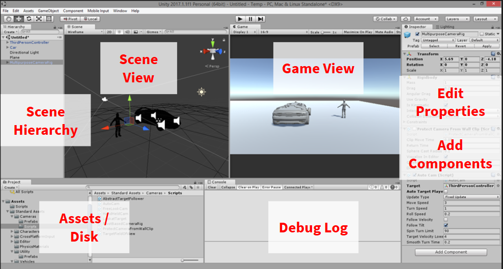

# [Feedback Form](https://docs.google.com/forms/d/e/1FAIpQLSd7DQD5rOxRkL9pYdwFRRgaHd12eefMpkwxRBqk2p6X0fqwtQ/viewform?usp=sf_link)

# Installing Unity

Unity can be installed from [https://unity3d.com/](https://unity3d.com/).

# The Answer for Everything

## [www.google.com](https://www.google.com)

# The UI

# Closing Words

- Changes in play mode are not saved!

  - Scene is deserialized from saved scene on play

- Use the log, watch for errors

- Browse Standard Assets, Component menu

- Easy to drag in assets from the internet

- [www.google.com](https://www.google.com)
